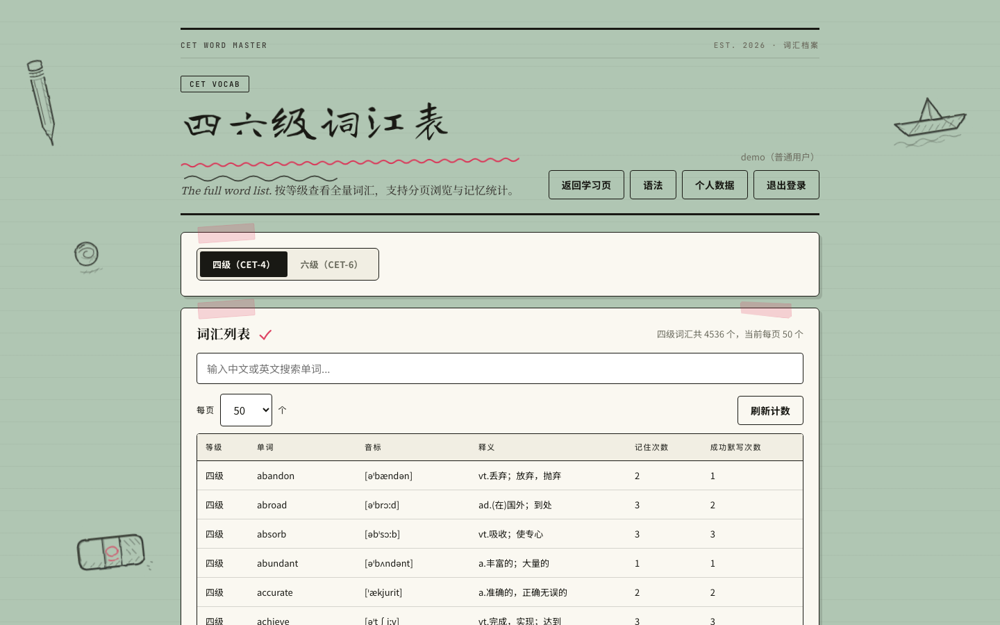
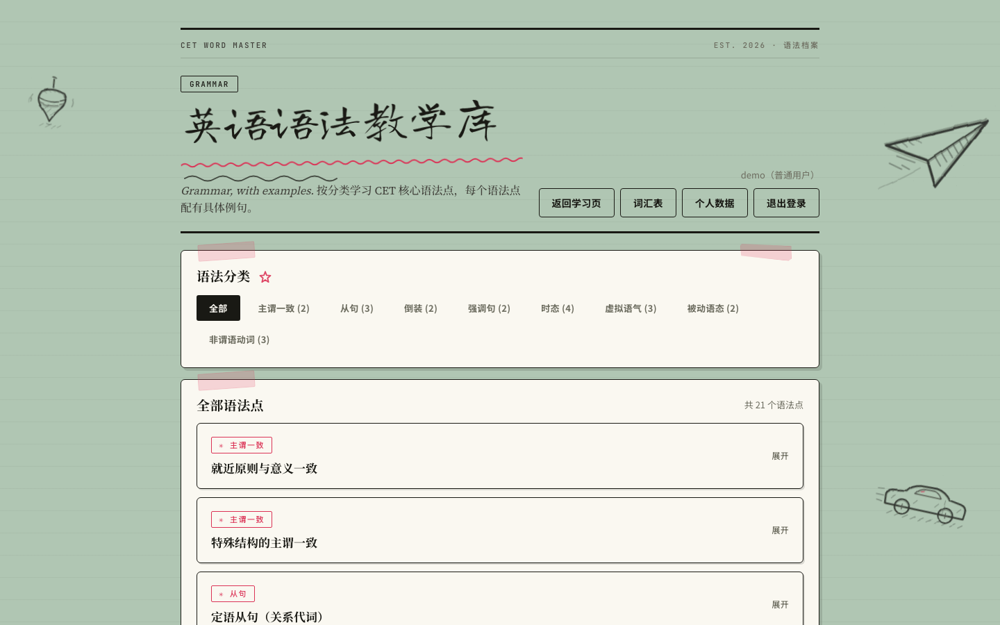
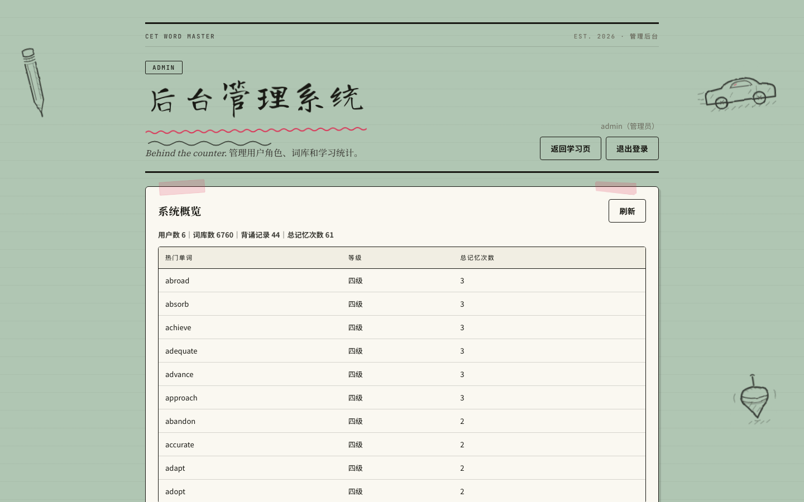
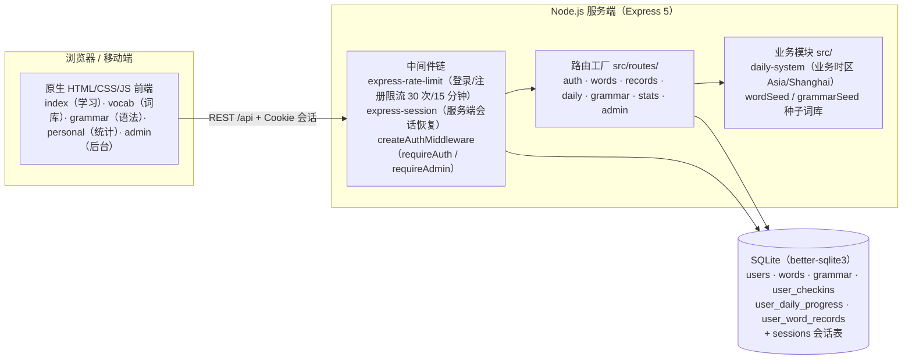

# CET Word Master - 英语四六级高频词背诵平台

> 🎯 一款基于 AI Agent 驱动开发的英语四六级高频词汇学习平台：**多用户、每日任务、默写测验、学习统计、管理后台、词库导入**，全栈由 Node.js + Express 5 + SQLite 驱动，原生 JS 前端，开箱即用。

[](https://nodejs.org)
[](https://expressjs.com)
[](https://github.com/WiseLibs/better-sqlite3)
[](https://nodejs.org/api/test.html)
[](https://www.docker.com)
[](https://kubernetes.io)
[](/LICENSE)

## 📸 界面预览

| 登录 / 注册 | 每日任务（20 词 + 进度） |
|---|---|
|  |  |

| 词库分页搜索 | 语法分类教学 |
|---|---|
|  |  |

| 个人学习数据（签到统计 + 图表） | 管理后台（概览 / 用户 / 词库） |
|---|---|
|  |  |

## ✨ 功能特性

- **📚 分级词库**：内置 CET-4（四级）和 CET-6（六级）高频词汇，支持高频词/全部词切换，可脚本化导入全量词库
- **🎯 每日任务**：每日自动分配 20 个单词（复习 + 新词），带签到日历与连续打卡统计
- **📝 默写测验**：英译中 / 中译英双向默写，自动记录成功次数并计算准确率
- **👤 多用户系统**：支持用户注册、登录，每个用户独立维护背诵记录
- **📊 学习追踪**：自动记录每个单词的记忆次数和最近复习时间，生成学习趋势图表
- **🔧 管理员后台**：系统概览、用户管理（角色分配）、单词 CRUD、热门单词排行、词库导入
- **📱 响应式设计**：适配桌面端和移动端，随时随地背单词
- **🔒 安全认证**：bcrypt 密码加密 + 服务端 SQLite 会话存储 + 会话固定防护 + 登录/注册限流

## 🏗️ 架构总览



**要点**：所有业务路由通过「路由工厂」按模块注册；认证、限流、业务时区（`APP_TIMEZONE`，默认 Asia/Shanghai）在中间件与 `daily-system` 层统一处理；会话存于 SQLite（`better-sqlite3-session-store`），无需外部 Redis 即可多实例共享。

## 🛠️ 技术栈

| 层级 | 技术 |
|------|------|
| 后端 | Node.js + Express 5 |
| 数据库 | SQLite（better-sqlite3） |
| 会话 | express-session + better-sqlite3-session-store |
| 认证 | bcryptjs + 会话固定防护（regenerate） |
| 安全 | express-rate-limit（登录/注册限流） |
| 前端 | 原生 HTML/CSS/JS（无框架、无构建步骤） |
| 测试 | node:test（Node 内置测试框架） |
| 部署 | Docker + Kubernetes（另有 Railway 方案） |

## 🚀 快速开始

### 本地运行

```bash
# 克隆项目
git clone https://github.com/your-username/cet-word-master.git
cd cet-word-master

# 安装依赖
npm install

# 启动服务
npm start
```

浏览器访问 `http://localhost:3000`

> ⚠️ http 直连（无 TLS）时请将 `.env` 中 `COOKIE_SECURE` 设为 `0`，否则浏览器会拒绝保存会话 Cookie 导致登录后全部 401。

### 导入完整词库（可选）

内置种子词库可直接使用；如需导入完整 CET4/CET6 词表（数千词），数据文件放在 `data/` 后执行：

```bash
npm run import:cet4   # 导入 CET4 全量词表（默认读取 data/CET4_full.txt，核心词 2000）
npm run import:cet6   # 导入 CET6 全量词表（同上）
```

### 默认账户

| 角色 | 用户名 | 密码 |
|------|--------|------|
| 管理员 | admin | admin123456 |

> ⚠️ 生产环境请通过环境变量 `ADMIN_PASSWORD` 修改默认密码

### 运行测试

```bash
npm test
```

共 **64 个 node:test 用例（14 个套件）**，覆盖认证、单词、背诵记录、每日任务系统与学习统计，全部通过。

## 📁 项目结构

```
cet-word-master/
├── server.js              # Express 服务端（API + 数据库初始化 + 会话 + 限流）
├── package.json           # 项目配置
├── .env.example           # 环境变量示例
├── .gitignore             # Git 忽略规则
├── DEPLOY.md              # 部署指南（Railway 等）
├── docker-compose.yml     # Docker Compose 编排
├── Dockerfile             # 容器镜像
├── k8s/                   # Kubernetes 部署清单
├── data/                  # 数据目录
│   ├── app.db             # SQLite 数据库（运行时生成）
│   ├── CET4_full.txt      # CET-4 完整词库
│   └── CET6_full.txt      # CET-6 完整词库
├── docs/
│   └── screenshots/       # 项目截图
├── public/                # 前端静态资源
│   ├── index.html         # 主页面（登录 + 每日任务 + 自由背词 + 默写 + 测验）
│   ├── app.js             # 主页面逻辑
│   ├── vocab.html         # 词汇学习页面（分页 + 搜索）
│   ├── vocab.js           # 词汇学习逻辑
│   ├── grammar.html       # 语法教学页面
│   ├── grammar.js         # 语法教学逻辑
│   ├── personal.html      # 个人数据页面（签到统计 + 图表）
│   ├── personal.js        # 个人数据逻辑
│   ├── admin.html         # 管理员后台页面
│   ├── admin.js           # 管理员后台逻辑
│   ├── shared.js          # 公共逻辑（认证/请求封装）
│   ├── effects.js         # 页面特效逻辑
│   ├── styles.css         # 前端样式
│   ├── decorations.css    # 装饰样式
│   └── effects.css        # 特效样式
├── scripts/               # 数据导入脚本
│   ├── import_cet4_full.js
│   └── import_cet6_full.js
├── src/                   # 服务端源码
│   ├── routes/            # 路由工厂（auth/words/records/daily/grammar/stats/admin）
│   ├── middleware/auth.js # 认证中间件
│   ├── daily-system.js    # 每日任务系统（业务时区）
│   ├── wordSeed.js        # 内置种子词库
│   └── grammarSeed.js     # 内置语法库
└── test/                  # node:test 测试（64 用例）
```

## 🔌 API 接口

### 认证相关

| 方法 | 路径 | 说明 | 权限 |
|------|------|------|------|
| GET | `/api/auth/me` | 获取当前用户信息 | 公开 |
| POST | `/api/auth/register` | 用户注册 | 公开 |
| POST | `/api/auth/login` | 用户登录 | 公开 |
| POST | `/api/auth/logout` | 退出登录 | 登录 |

### 单词相关

| 方法 | 路径 | 说明 | 权限 |
|------|------|------|------|
| GET | `/api/words` | 获取单词列表 | 登录 |
| GET | `/api/words/paged` | 分页获取单词 | 登录 |
| GET | `/api/words/search` | 搜索单词 | 登录 |

### 每日任务 / 背诵记录

| 方法 | 路径 | 说明 | 权限 |
|------|------|------|------|
| POST | `/api/daily/checkin` | 每日签到 | 登录 |
| GET | `/api/daily/today` | 获取今日 20 词任务 | 登录 |
| POST | `/api/daily/memorize` | 记录"记住" | 登录 |
| POST | `/api/daily/dictation` | 记录默写结果 | 登录 |
| GET | `/api/records` | 获取我的背诵记录 | 登录 |
| POST | `/api/records/remember` | 记录"记住" | 登录 |
| POST | `/api/records/dictation-success` | 记录默写成功 | 登录 |
| DELETE | `/api/records` | 清空背诵记录 | 登录 |
| GET | `/api/stats` | 学习统计（签到/词数/趋势/薄弱词） | 登录 |
| GET | `/api/grammar` | 语法库列表 | 登录 |

### 管理员接口

| 方法 | 路径 | 说明 | 权限 |
|------|------|------|------|
| GET | `/api/admin/overview` | 数据概览 | 管理员 |
| GET | `/api/admin/users` | 用户列表 | 管理员 |
| PATCH | `/api/admin/users/:id/role` | 修改用户角色 | 管理员 |
| GET | `/api/admin/words` | 单词管理列表 | 管理员 |
| POST | `/api/admin/words` | 新增单词 | 管理员 |
| PUT | `/api/admin/words/:id` | 更新单词 | 管理员 |
| DELETE | `/api/admin/words/:id` | 删除单词 | 管理员 |

## 🌐 部署

### Docker

```bash
docker build -t cet-word-master:1.0.0 .
docker run -d -p 3000:3000 \
  -e SESSION_SECRET=your-long-random-secret \
  -e ADMIN_PASSWORD=your-strong-password \
  -e COOKIE_SECURE=0 \
  -v cet-word-data:/app/data \
  cet-word-master:1.0.0
```

或使用 docker compose：

```bash
cp .env.example .env   # 填写 SESSION_SECRET / ADMIN_PASSWORD
docker compose up -d
```

### Kubernetes

完整清单见 [k8s/](k8s/)，支持 `kubectl apply -k k8s/` 一键部署。架构：Ingress → Service → 单副本 Pod + PVC 持久化 SQLite，含健康探针、资源限制、非 root 安全上下文。详见 [k8s/README.md](k8s/README.md)。

### Railway

传统 PaaS 方案详见 [DEPLOY.md](DEPLOY.md)。

### 环境变量

| 变量 | 说明 | 默认值 |
|------|------|--------|
| `PORT` | 服务端口 | 3000 |
| `NODE_ENV` | 运行环境 | development |
| `TRUST_PROXY` | 信任代理 | 0 |
| `COOKIE_SECURE` | Session cookie 是否仅通过 HTTPS 发送；http 直连部署（无 TLS）必须设为 0，否则浏览器拒绝保存 cookie、登录后全部 401 | 跟随 NODE_ENV（生产为 1） |
| `SESSION_SECRET` | Session 密钥 | cet-secret-change-this |
| `ADMIN_PASSWORD` | 管理员密码 | admin123456 |
| `DATA_DIR` | 数据目录 | ./data |
| `APP_TIMEZONE` | 业务时区（签到/每日任务按此计算日期） | Asia/Shanghai |

## 📝 开发说明

本项目全程使用 **AI Agent（Roo Code / Claude）** 辅助开发，涵盖：

- 需求分析与架构设计
- 后端 API 设计与实现
- 数据库 Schema 设计
- 前端页面与交互开发
- 部署方案设计
- 自动化测试（node:test）

## 📄 License

ISC
